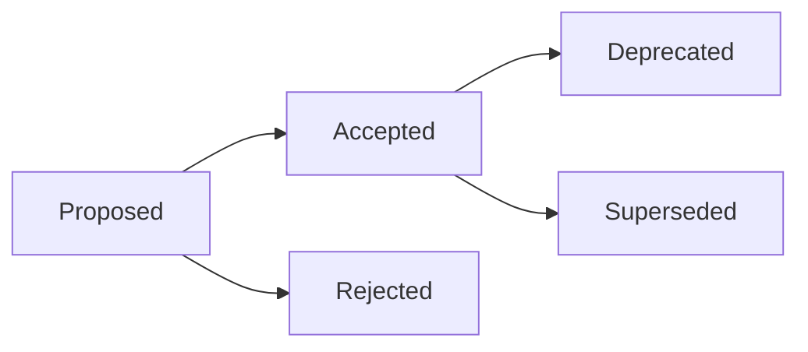

# Architecture Decision Records

This directory contains Architecture Decision Records (ADRs) for the reedACT project.

## What is an ADR?

An Architecture Decision Record captures an important architectural decision made along with its context and consequences. ADRs help us:
- Document why decisions were made
- Share context with new team members
- Review decisions when circumstances change
- Avoid repeating past discussions

## ADR Index

| ADR | Title | Status | Date |
|-----|-------|--------|------|
| [000](000-template.md) | ADR Template | Template | - |
| [001](001-why-axum.md) | Use Axum as Web Framework | Accepted | 2024-01 |
| [002](002-why-tera.md) | Use Tera as Template Engine | Accepted | 2024-01 |
| [003](003-security-isolation-model.md) | Security Isolation Model for Language Execution | Accepted | 2024-01 |

## Creating a New ADR

1. Copy `000-template.md` to a new file with the next number
2. Fill in all sections
3. Submit a PR with the proposed ADR
4. After discussion and acceptance, update status to "Accepted"
5. Update this README with the new ADR

## ADR Lifecycle

- **Proposed**: Under discussion
- **Accepted**: Approved and in effect
- **Deprecated**: No longer recommended but not replaced
- **Superseded**: Replaced by another ADR
- **Rejected**: Not accepted after discussion

## Guidelines

- Keep ADRs concise but complete
- Focus on the "why" more than the "how"
- Include real alternatives that were considered
- Be honest about trade-offs
- Link to related ADRs and external resources

## References

- [Michael Nygard's ADR article](https://cognitect.com/blog/2011/11/15/documenting-architecture-decisions)
- [ADR GitHub organization](https://adr.github.io/)